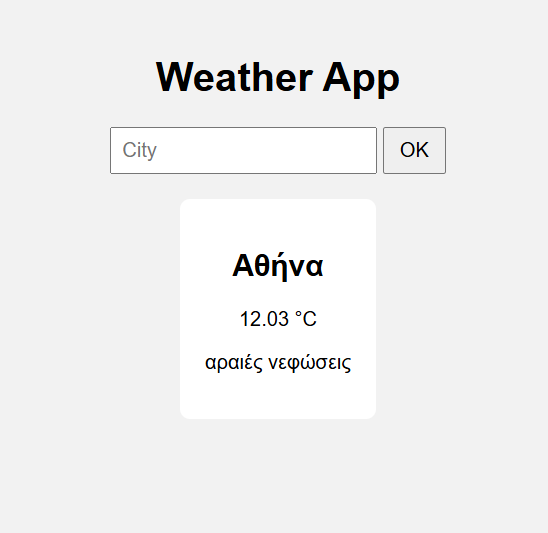

# Weather App (Flask)

Simple weather web application built with Python and Flask.

## Features
- Search weather by city
- Current temperature and description
- Data from OpenWeather API

## Screenshot


## Technologies
- Python
- Flask
- HTML / CSS
- OpenWeather API

## How to run
1. Install dependencies:
```bash
pip install -r requirements.txt
